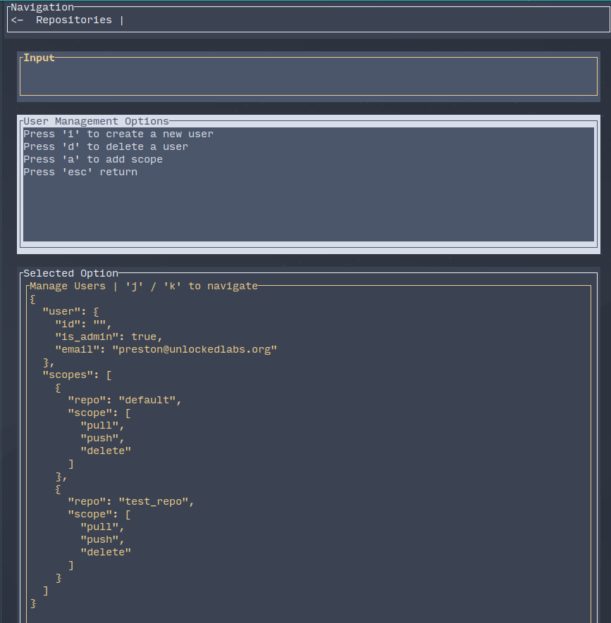
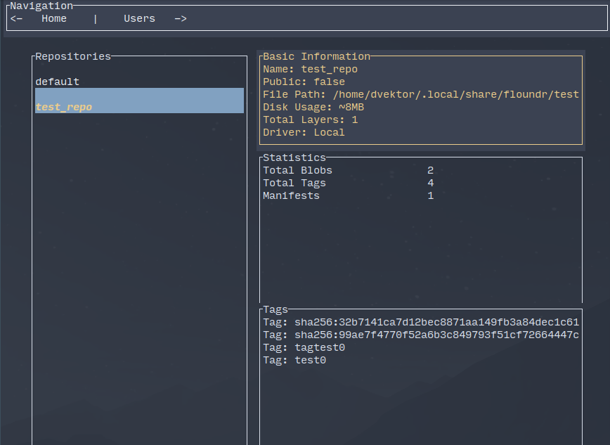
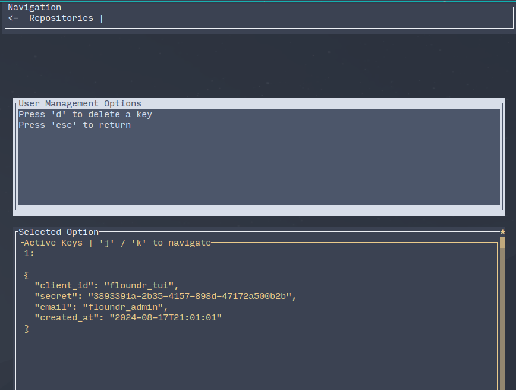
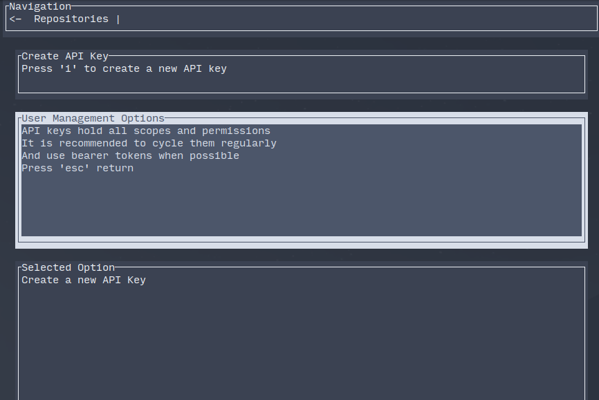

# Floundr: OCI Container Registry + TUI Client

<div align="center">

</div>

**Floundr** is a _WIP_ container registry written in Rust with Axum, and an accompanying TUI client built with [Ratatui](https://github.com/ratatui-org/ratatui)
The eventual goal is a registry designed to be simple, efficient, and easy to manage, aiming to be fully compliant with
the OCI distribution spec.

## Current State | Existing Features

This project is in active development and is not fully OCI compliant at this time. The following features
exist in the project in some form but are not fully implemented or tested, it is not recommended for production use.

- **Authentication:** `docker login`, with basic and bearer authentication and scoped tokens.
- **User Management**: Limited user management in the TUI client.
- **Basic Docker Push/Pull:** basic `docker push | pull` commands are supported.
- **TUI Client:** _WIP_ Manage the registry through a terminal-based interface built with Ratatui.
- **Storage Backend:** Local storage is currently supported (Tokio async I/O)

## Roadmap | TODO

- **Complete Specification Compliance**: Finish endpoints to be fully compliant with the OCI distribution spec.
- **Complete User Roles and Permissions**: Add/Edit Scopes for each User or API key in the client.
- **S3 Storage Driver**: Add support for S3 storage backend + decouple disk persistence from the DB layer.
- **Garbage Collection**: Run garbage collection to remove ref-counted unused layers on a schedule.

## Installation

To get started with Floundr, you'll need to have Rust installed on your system. You can install Rust using [rustup](https://rustup.rs/).

1. Clone the repository:

   ```sh
   git clone https://github.com/PThorpe92/floundr.git
   cd floundr
   ```

2. Build the project:

   ```sh
   cargo build --release
   ```

3. Set the `FLOUNDR_HOME` & `DB_PATH` environment variables in your .env file:

   ```sh
   FLOUNDR_HOME=/path/to/your/storage
   DB_PATH=/path/to/your/db
   APP_URL=localhost:8080
   JWT_SECRET_KEY=your_secret_key
   HOST=host
   PORT=port

   # for development, you will need to set the following
   export APP_URL=debug
   export DATABASE_URL=sqlite://path/to/your/db
   ```

4. Run the commands to create a new repository and user:

```sh
./target/release/floundr new-repo <my-repo> --public

./target/release/floundr new-user <email> --password <password>
```

6. Compile and Run the TUI client

```sh
cd tui_client && cargo run --release
```

7. The client will write a `floundr.yml` file to the value of your `FLOUNDR_HOME` environment variable
   It will have the default email + password, which you can swap out for the ones you created.
   Optionally, you can also create a new API key with the `gen-key <file>` flag and it will write the key to
   the file you specify. Be aware that API keys hold full scope to all repositories, and if logging in with
   `docker login`, it will only request the scope needed for the operation.

Run --help for all options

```sh

Usage: floundr [OPTIONS] [COMMAND]

Commands:
  migrate-fresh  Migrate the database to a fresh state
  new-repo       Create a new repository with the given name
  new-user       Create a new user with the given email
  gen-key        Generate a new API key for a user with administrative privileges
  help           Print this message or the help of the given subcommand(s)

Options:
  -p, --port <PORT>                    [default: 8080]
      --storage-path <STORAGE_PATH>
      --home-dir <CONTAINER_HOME_DIR>  path to the floundr home directory (default is $XDG_DATA_HOME/floundr)
  -d, --db-path <DB_PATH>              path to the sqlite database
      --driver <DRIVER>                [default: local] [possible values: local] (TODO: s3)
      --debug                          Enable debug mode
  -h, --help                           Print help
  -V, --version                        Print version
```

### TUI Client

The TUI client provides a straightforward interface for managing your images and repositories.
Manage users, repositories and API keys with vim keybindings.










## Contributing

Contributions are very welcome! Lots of low hanging fruit, this was open sourced earlier than I would have preferred because I have limited time to work on it. Please feel free to submit issues, feature requests, or pull requests.

## License

Floundr is released under the MIT License. See the [LICENSE](LICENSE) file for more details.

## Why?

Part RWIIR (re-write it in rust) syndrome, part any reason to use [ratatui](https://github.com/ratatui-org/ratatui)

## **Fun fact:**

> This project was developed in the Maine State Prison system, where the author is currently incarcerated. I would like to bring whatever awareness possible to the importance of education and rehabilitation for those 2.2 million Americans currently incarcerated. I have a [blog post](https://pthorpe92.dev/intro/my-story/) if you are interested in reading about my story.

For any questions, please open an issue or reach out to [preston@pthorpe92.dev](mailto:preston@pthorpe92.dev).
