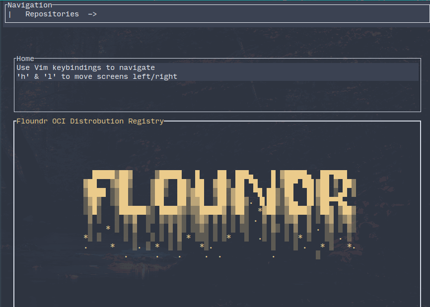

# Floundr: Container Registry + TUI Client


**Floundr** is a WIP Docker container registry written in Rust with Axum, and a TUI client built with [Ratatui](https://github.com/ratatui-org/ratatui)
The goal is a registry designed to be simple, efficient, and easy to manage, aiming to be fully compliant with
the OCI distribution spec.

## Current State/Existing Features

- **Authentication:** `docker login` is supported, with basic and bearer authentication.
- **Basic Docker Push/Pull:** basic `docker push | pull` commands are supported.
- **TUI Client:** _WIP_ Manage the registry through a terminal-based interface built with Ratatui.
- **Storage Backends:** Local storage is currently supported.

### Roadmap | TODO

- **Complete Specification Compliance**: Floundr aims to be fully compliant with the OCI distribution spec.
- **S3 Storage Driver**: Add support for S3 storage backend.
- **User Management**: Role-based access control and user management in the TUI client.
- **Web-based Dashboard:** A future goal is to build a web interface to complement the TUI.
- **Garbage Collection**: Run garbage collection to remove ref-counted unused layers on a schedule.

## Installation

To get started with Floundr, you'll need to have Rust installed on your system. You can install Rust using [rustup](https://rustup.rs/).

1. Clone the repository:

   ```sh
   git clone https://github.com/PThorpe92/floundr.git
   cd floundr
   ```

2. Build the project:

   ```sh
   cargo build --release
   ```

3. Run the server:

   ```sh
   ./target/release/floundr
   ```

4. Run --help for all options

```sh
Usage: floundr [OPTIONS]

Options:
  -p, --port <PORT>
          [default: 8080]
      --storage-path <STORAGE_PATH>

      --container-home-dir <CONTAINER_HOME_DIR>

      --db-path <DB_PATH>

      --migrate-fresh

      --new-repo <NEW_REPO>
          Create a new repository with a given name
      --public <PUBLIC>
          whether the new repository is public [possible values: true, false]
      --email <EMAIL>
          email for new user
      --password <PASSWORD>
          new user password
      --driver <DRIVER>
          [default: local] [possible values: local] # (todo s3)
      --debug
          Enable debug mode
      --secret <SECRET>
          generate new registry secret and write to file
  -h, --help
          Print help
  -V, --version
          Print version
```

### TUI Client

The TUI client provides a straightforward interface for managing your images and repositories. Navigate through your stored images, push new ones, and monitor activity—all from your terminal.




## Contributing

Contributions are welcome! Please feel free to submit issues, feature requests, or pull requests.

1. Fork the repository
2. Create your feature branch (`git checkout -b feature/your-feature`)
3. Commit your changes (`git commit -m 'Add some feature'`)
4. Push to the branch (`git push origin feature/your-feature`)
5. Open a pull request

## License

Floundr is released under the MIT License. See the [LICENSE](LICENSE) file for more details.

## Contact

For any questions, please open an issue or reach out to [preston@pthorpe92.dev](mailto:preston@pthorpe92.dev).
